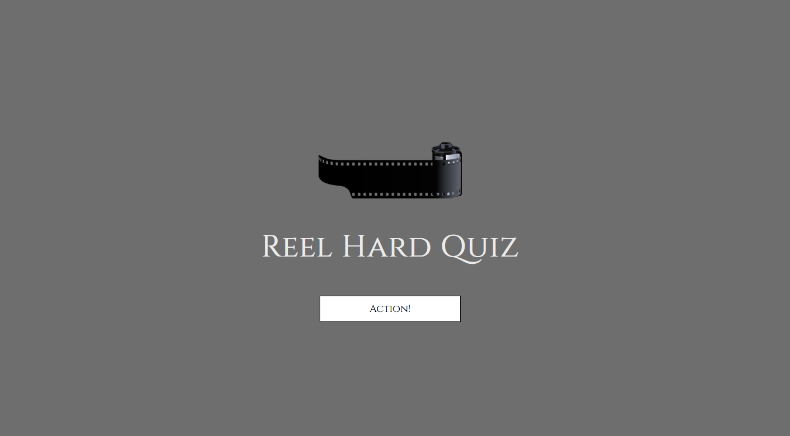
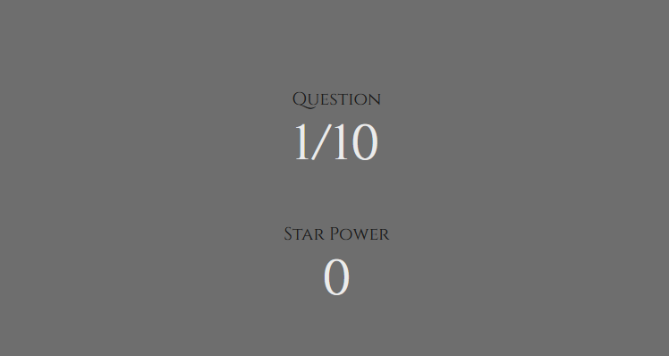
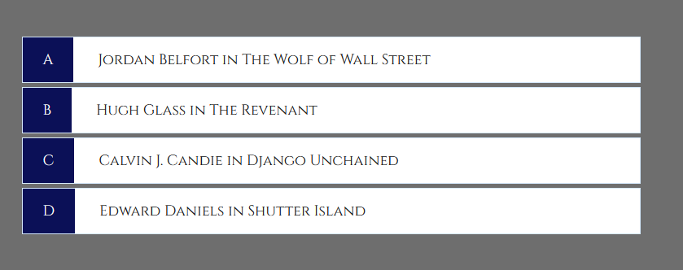
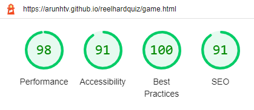

# Reel Hard Quiz

## About
   My site is an online quiz site called Reel Hard Quiz. It is aimed at avid movie fans who want to flex or challenge their knowledge. This audience does tend to be older but the quiz can also be enjoyed by younger fans who want to expand their movie knowledge or test what they already know about popular IP’s such as Batman and Lord of The Rings.

## Homepage
-	I have tried to keep my design as simple as possible while still having some character. The title of the page is featured prominently in the centre. To keep in with the theme and also to avoid any confusion regarding the title (I had sent the deployed page to a few friends, a couple of the less avid movie fans didn’t get the reference until I explained and had thought it was a typo), an image of a film reel just above it.
-	A button is included underneath the title to take you to the game page

## Game Page

### HUD
-	At the top of my page is the question counter, included so the user knows how close they are to the beginning and end of the quiz. It is also a good visual cue for the developer as the JavaScript used is meant to randomise questions so it can be useful to see questions show up at different times of the quiz
-	Below the question counter, is the “Star Power” meter, which is essentially a score tally. This is included so the user knows how they are doing on the quiz
-	After seeing the screen looks a bit bare when set out horizontally, the HUD has been stacked horizontally

### Question Area

#### Questions

   The questions are in a big font as to serve as the focal point of the quiz. Using JavaScript, these have been hardcoded to appear in random sequence with 10  of 15 possible questions for the user to answer. More than the quizzes maximum 10 questions have been written so the experience changes with each session, giving the user a more dynamic experience rather than the same 10 questions in the same order

#### Choice Boxes

   The choice boxes are made from buttons and styled similarly to the one found on the launch page. However, these have text hardcoded inside them that change to correspond with the next question. The script on the game.js file has also been used to highlight the boxes red or green, corresponding with incorrect and correct answers respectively

## Possible Future Implementations

-	Later on in the process, I had the idea to have a form on the launch page so the user can input their name and have their name displayed on top of the game page. I did give this a go but ran into some problems with having it display properly with each question due to how the choice boxes expand as it was becoming obscured at the top of the page. Because of how late in the process it was, I didn’t have time to implement it properly so scrapped the idea but it is something  to revisit to further enhance the user experience
-	Now that I have a better understanding of JavaScript via learning through modules and tutorials, I will add images that go with the questions. I didn’t implement it this time around as this is another idea that came late in designing but decided again it due to having to resize the images and format them with the questions in an already packed interface which may have taken up too much time

## Testing/Bugs

-	Quite a lot of testing was done to ensure that the game runs well. This includes testing the responsiveness using a laptop window with my own mobile phone and sending the deployed site to friends using various mobile phones
-	 On certain phone screens, some of the HUD was obscured due to how the choices boxes and questions would expand depending on the questions/answers. This was sorted by adding a media query to my style sheets that made the text smaller to correspond with the screen size
-	The site originally wouldn’t load the homepage as I had mislabelled the index page in Gitpod. This was sorted by simply renaming my homepage to “index.html”
-	After sorting the homepage, I ran into the issue of my game page not loading and instead coming up with the 404 error. I spoke to a tutor who reminded me of something in the submissions page pertaining to errors in loading being caused by slashes being left in code when referencing HTML, CSS and JavaScript. I used the slash as it’s a convenient tool when referencing html pages as you can find the code pages/assets by seeing them in the hierarchy and simply clicking them, which minimises mistakes like typos which can affect how a page runs. I got rid of every slash that didn’t need to be there and the whole site worked fine after

### Validator Testing

    Below are the results of testing the various code that made up the game page as of the completion of testing bugs

#### HTML

    No errors were returned when passing through the official W3C validator: https://validator.w3.org/nu/?doc=https%3A%2F%2Farunhtv.github.io%2Freelhardquiz%2Fgame.html

#### CSS

	No errors were found when passing through the official (Jigsaw) validator: https://jigsaw.w3.org/css-validator/validator?uri=https%3A%2F%2Farunhtv.github.io%2Freelhardquiz%2Fgame.html&profile=css3svg&usermedium=all&warning=1&vextwarning=&lang=en

#### JavaScript

   Some warnings cropped up when running the game JS through JSHint but no errors
-	There are 7 functions in this file.
-	Function with the largest signature take 1 arguments, while the median is 1.
-	Largest function has 11 statements in it, while the median is 2.
-	The most complex function has a cyclomatic complexity value of 4 while the median is 1.

#### Lighthouse

## Credits

   For the majority of the JavaScript, I used a video tutorial series that implemented a lot of what I wanted for my own game. The URL of the video series is below, however, the specific videos I have used to learn or use certain pieces of code have been cited in the JavaScript files in the repository (script.js and gameover.js):

   https://www.youtube.com/playlist?list=PLDlWc9AfQBfZIkdVaOQXi1tizJeNJipEx

   The reason why this was used was because while previous lessons were useful in learning the basics, a lot of what I wanted to include such as keeping the questions random and having more than the ten questions encountered in a session so the user can have a different experience with each play. This was made possible by learning how to using constants in conjunction with the MathFloor method, something I can use for future projects. A lot of the same names of ids, classes and variables were also used but is simply because it was the best names for them in terms of making the code clear for me and anyone looking at it (calling a variable currentQuestion for code affecting the current question or a constant called MAX_QUESTIONS for code affecting the maximum questions etc.)

